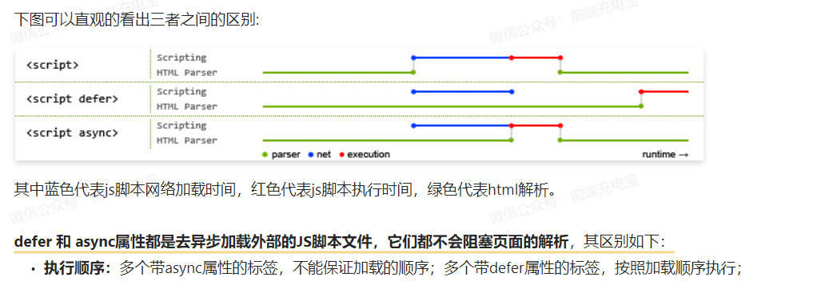

# src和href的区别是什么？
## src
```html
- 当浏览器解析到src ，会暂停其他资源的下载和处理，直到将该资源加载或执行完毕。
<!-- src加载图片文件 -->

<!-- js -->
<script src="./1.js"></script>
```
## href
- 并行下载资源，使用@import是CSS文件加载后再导入的文件，造成额外的网络请求延迟，权重更低
```html
<!-- 引入css样式表 -->
<link rel="stylesheet" href="./">
<!-- a标签跳转 -->
<a href="http://www.baidu.com"></a> 
```
# defer和async的区别
- defer可以保证按顺序执行，再html解析之后进行执行
- async是并行加载之后就直接执行，不能保证顺序


# 标签语义化
```html
<!-- header头部 -->
<!-- nav导航栏 -->
<!-- section 区块 -->
<!-- main 主要区域 -->
<!-- article 主要内容 -->
<!-- aside 侧边栏 -->
<!-- footer 底部 -->
```
# 

