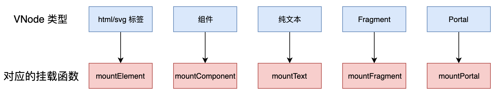

# 责任重大的渲染器

所谓渲染器，简单的说就是将 `Virtual DOM` 渲染成特定平台下真实 `DOM` 的工具(就是一个函数，通常叫 `render`)，渲染器的工作流程分为两个阶段：`mount` 和 `patch`，如果旧的 `VNode` 存在，则会使用新的 `VNode` 与旧的 `VNode` 进行对比，试图以最小的资源开销完成 `DOM` 的更新，这个过程就叫 `patch`，或“打补丁”。如果旧的 `VNode` 不存在，则直接将新的 `VNode` 挂载成全新的 `DOM`，这个过程叫做 `mount`。

通常渲染器接收两个参数，第一个参数是将要被渲染的 `VNode` 对象，第二个参数是一个用来承载内容的容器(`container`)，通常也叫挂载点，如下代码所示：

```js
function render(vnode, container) {
  const prevVNode = container.vnode
  if (prevVNode == null) {
    if (vnode) {
      // 没有旧的 VNode，只有新的 VNode。使用 `mount` 函数挂载全新的 VNode
      mount(vnode, container)
      // 将新的 VNode 添加到 container.vnode 属性下，这样下一次渲染时旧的 VNode 就存在了
      container.vnode = vnode
    }
  } else {
    if (vnode) {
      // 有旧的 VNode，也有新的 VNode。则调用 `patch` 函数打补丁
      patch(prevVNode, vnode, container)
      // 更新 container.vnode
      container.vnode = vnode
    } else {
      // 有旧的 VNode 但是没有新的 VNode，这说明应该移除 DOM，在浏览器中可以使用 removeChild 函数。
      container.removeChild(prevVNode.el)
      container.vnode = null
    }
  }
}
```



# mountElement
```javascript
function mountElement(vnode, container, isSVG) {
  isSVG = isSVG || vnode.flags & VNodeFlags.ELEMENT_SVG
  const el = isSVG
    ? document.createElementNS('http://www.w3.org/2000/svg', vnode.tag)
    : document.createElement(vnode.tag)
  vnode.el = el
  const data = vnode.data
  if (data) {
    for (let key in data) {
      switch (key) {
        case 'style':
          for (let k in data.style) {
            el.style[k] = data.style[k]
          }
          break
        case 'class':
          if (isSVG) {
            el.setAttribute('class', data[key])
          } else {
            el.className = data[key]
          }
          break
        default:
          if (key[0] === 'o' && key[1] === 'n') {
            // 事件
            el.addEventListener(key.slice(2), data[key])
          } else if (domPropsRE.test(key)) {
            // 当做 DOM Prop 处理
            el[key] = data[key]
          } else {
            // 当做 Attr 处理
            el.setAttribute(key, data[key])
          }
          break
      }
    }
  }
```
# mountText

```javascript
function mountText(vnode, container) {
  const el = document.createTextNode(vnode.children)
  vnode.el = el
  container.appendChild(el)
}
```


# patchData

```js
const domPropsRE = /\W|^(?:value|checked|selected|muted)$/

export function patchData(el, key, prevValue, nextValue) {
  switch (key) {
    case 'style':
      for (let k in nextValue) {
        el.style[k] = nextValue[k]
      }
      for (let k in prevValue) {
        if (!nextValue.hasOwnProperty(k)) {
          el.style[k] = ''
        }
      }
      break
    case 'class':
      el.className = nextValue
      break
    default:
      if (key[0] === 'o' && key[1] === 'n') {
        // 事件
        // 移除旧事件
        if (prevValue) {
          el.removeEventListener(key.slice(2), prevValue)
        }
        // 添加新事件
        if (nextValue) {
          el.addEventListener(key.slice(2), nextValue)
        }
      } else if (domPropsRE.test(key)) {
        // 当做 DOM Prop 处理
        el[key] = nextValue
      } else {
        // 当做 Attr 处理
        el.setAttribute(key, nextValue)
      }
      break
  }
}

```


