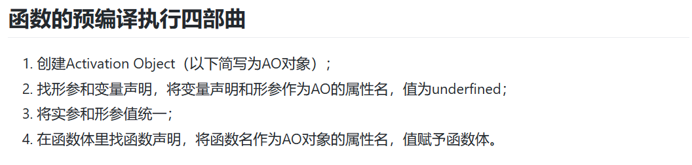
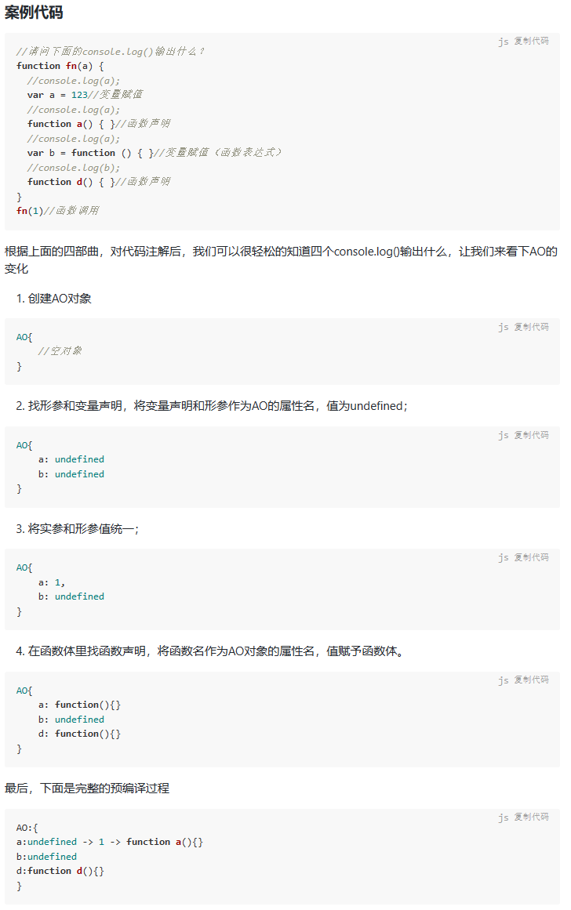
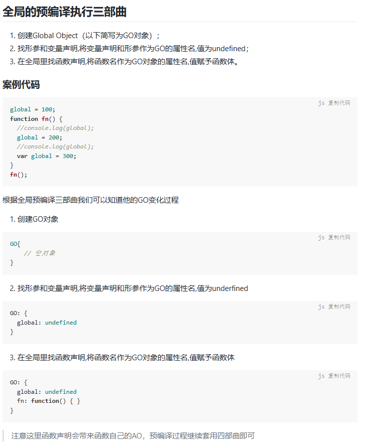
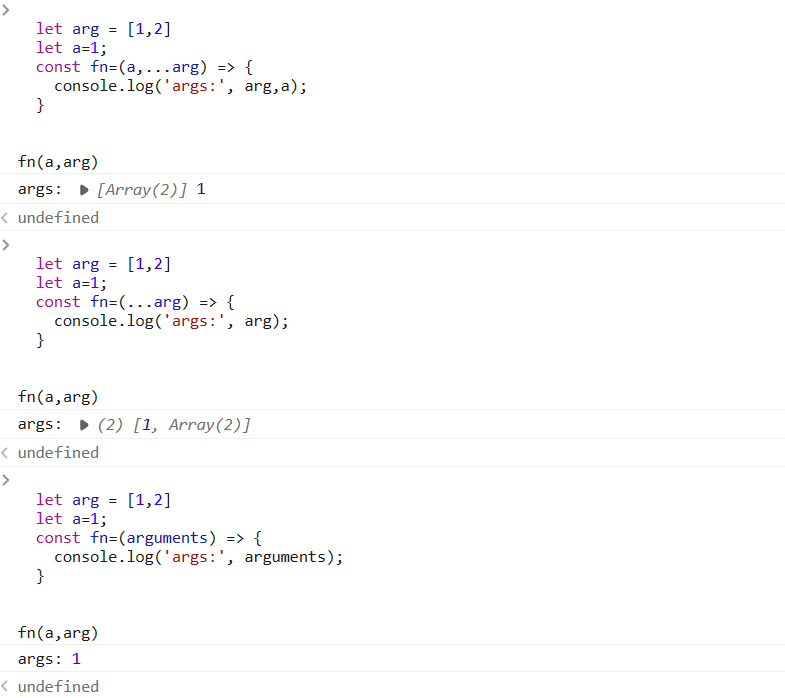
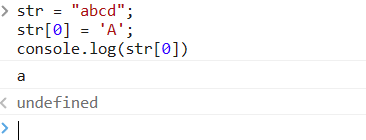

# ES6背景小知识
- Babel是广泛使用的ES6转码器
- Babel 默认只转换新的 JavaScript 句法（syntax），而不转换新的 API，比如Iterator、Generator、Set、Map、Proxy、Reflect、Symbol、Promise等全局对象，以及一些定义在全局对象上的方法（比如Object.assign）都不会转码。
# JavaScript预编译
## 传统编译语言编译步骤
1. **词法分析** 这个过程会将代码分隔成一个个**词法单元**，比如var a = 520;这段代码通常会被分解为var，a，=，520这4个**词法单元**。
2. **语法分析** 这个过程是将**词法单元**整合成一个**多维数组**，即**抽象语法树(AST)**，以下面代码为例
当JavaScript解释器在**构造语法树**的时候，如果发现无法构造，就会**报语法错误(syntaxError)**，并结束整个代码块的解析。
3. **代码生成** 这个过程是将**抽象语法树AST**转变为**可执行的机器代码**，让计算机能读懂执行。
## JavaScript编译步骤
- JavaScript引擎要复杂得多。
- 例如，在语法分析和代码生成阶段有特定的步骤来对运行性能进行优化，包括对冗余元素进行优化等。
1. 语法分析 
2. 预编译 
- JavaScript预编译发生在**代码片段执行前的几微秒（甚至更短！）**，预编译分为两种，一种是**函数预编译**，另一种是**全局预编译**，全局预编译发生在**页面加载完成时**执行，函数预编译发生在**函数执行的前**一刻。预编译会**创建**当前环境的执行上下文。

3. 解释执行
# JavaScript 数据类型和数据结构
js为什么是一种动态类型的动态语言？
- js中的变量与任何特定值类型没有任何关联 并且任何变量都可以重新分配所有类型的值
  ``
    let foo = 42; // foo 现在是一个数值
    foo = "bar"; // foo 现在是一个字符串
    foo = true; // foo 现在是一个布尔值
  ``
- js也是一个弱类型的语言 这意味着操作涉及不匹配的类型是否，它将允许隐式类型转换，而不是像其他语言一样抛出异常
  ``
    const foo = 42; // foo is a number
    const result = foo + "1"; 
    console.log(result); // 421
  ``
# let和const命令

## let命令
- for循环语句中的父子作用域问题——参照1.js
- 不存在变量提升 -> -> -> -> -> 暂时性死区
- 暂时性死区
- 不允许重复声明
## 块级作用域
- 为什么需要块级作用域？
  - 第一种场景，内层变量可能会覆盖外层变量。
  - 第二种场景，用来计数的循环变量泄露为全局变量。
- **块级作用域与函数声明？？？**
## const命令
- 基本用法
  - const声明一个只读的常量。一旦声明，常量的值就不能改变。
  - const声明的变量不得改变值，这意味着，const一旦声明变量，就必须立即初始化，不能留到以后赋值。
  - 作用域问题也和let一样
- 本质
  -  const实际上保证的，并不是变量的值不得改动，而是**变量指向的那个内存地址所保存的数据不得改动**。
  -  复合类型的数据（主要是对象和数组），变量指向的内存地址，保存的只是一个指向实际数据的指针，const只能**保证这个指针是固定的（即总是指向另一个固定的地址）**，至于它指向的数据结构是不是可变的，就完全不能控制了。
  - 对象冻结，应该使用Object.freeze方法。
## 顶层对象的属性
- 顶层对象，在浏览器环境指的是window对象，在 Node 指的是global对象。**ES5** 之中，**顶层对象的属性与全局变量是等价的**。
- ES6 为了改变这一点，一方面规定，为了保持兼容性，**var命令和function命令声明的全局变量，依旧是顶层对象的属性**；另一方面规定，**let命令、const命令、class命令声明的全局变量，不属于顶层对象的属性**。也就是说，从 ES6 开始，全局变量将逐步与顶层对象的属性脱钩。
## globalThis对象
- 引入globalThis作为顶层对象。也就是说，任何环境下，globalThis都是存在的，都可以从它拿到顶层对象，指向全局环境下的this。

# 作用域
MDN文档:
https://developer.mozilla.org/zh-CN/docs/Glossary/Scope
## 概念
- 这些问题说明需要一套设计良好的规则来存储变量，并且之后可以方便地找到这些变量。这套规
则被称为作用域。
- 当一个块或函数嵌套在另一个块或函数中时，就发生了作用域的嵌套。因此，在当前作用域中无法找到某个变量时，引擎就会在外层嵌套的作用域中继续查找，直到找到该变量，或抵达最外层的作用域（也就是全局作用域）为止。
- 再参考《你不知道的js（上）》第一章

# 变量的解构赋值
## 数组的解构赋值
- 只要某种数据结构具有 Iterator 接口，都可以采用数组形式的解构赋值。
## 对象的解构赋值
- 数组的元素是**按次序排列的**，变量的取值由它的位置决定；而对象的属性**没有次序**，变量必须与属性同名，才能取到正确的值。
- 对象的解构也可以指定默认值。
## 字符串的解构赋值
## 用途
- 交换变量的值
- 从函数返回多个值
- 函数参数的定义
- 提取json数据
- 函数参数的默认值
- 遍历Map解构
- 输入模块的指定方法

# 字符串的扩展
## 字符串的遍历器接口

# 函数的拓展
- 函数参数的默认值
- rest参数
- 箭头函数
  箭头函数有几个使用注意点。

（1）箭头函数**没有**自己的**this**对象（详见下文）。

（2）**不可以**当作**构造函数**，也就是说，**不可以**对箭头函数使用**new**命令，否则会抛出一个错误。

（3）**不可以**使用**arguments对象**，该对象在函数体内不存在。如果要用，可以用 rest 参数代替。

（4）不可以使用yield命令，因此箭头函数**不能**用作 **Generator 函数**。

- 对于普通函数来说，内部的this指向**函数运行时所在的对象**，但是这一点对箭头函数不成立。它没有自己的this对象，内部的this就是**定义时上层作用域中的this**。
- 箭头函数实际上可以**让this指向固定化**，绑定this使得它不再可变，这种特性很有利于**封装回调函数。**
- 箭头函数根本没有自己的this，**导致内部的this就是外层代码块的this**。正是因为它没有this，所以也就**不能用作构造函数**。
- 这是因为所有的内层函数都是箭头函数，都没有自己的this，**它们的this其实都是最外层foo函数的this。**
- 箭头函数没有自己的this，所以**bind方法无效**，内部的this指向外部的this。
- 不适用场合
    - 由于箭头函数使得this从**“动态”变成“静态”**，下面两个场合不应该使用箭头函数。
    - cat.jumps()方法是一个箭头函数，这是错误的。
    - 这是因为**对象不构成单独的作用域**，导致jumps箭头函数定义时的作用域就是全局作用域。
    - 需要动态this的时候，也不应使用箭头函数。
- 尾调用优化
  - 

# 对象的拓展
- this关键字总是指向函数所在的当前对象，ES6 又新增了另一个类似的关键字super，指向当前对象的原型对象。只能用**在对象的方法之中，用在其他地方都会报错。**

# Promise
- ES6 规定，Promise对象是一个构造函数，用来生成Promise实例。
- 把一个**函数当作参数传递**，传递的是函数的定义**并不会立即执行**，而是在将来**特定的时机再去调用**，这个函数就叫做回调函数。在定时器setTimeout以及Ajax的请求时都会用到回调函数。
- 回调地狱
  - 这种**回调函数的层层嵌套**，就叫做回调地狱。回调地狱会造成代码可**复用性不强**，**可阅读性差**，**可维护性(迭代性差)**，**扩展性**差等等问题

# Set Map symbol

# Eventloop
- Event Loop即事件循环，是指**浏览器或Node**的一种解决**javaScript单线程运行时不会阻塞**的一种**机制**，也就是我们经常使用异步的原理。
- 堆是一种数据结构，是利用**完全二叉树维护的一组数据**，堆分为两种，一种为最大堆，一种为最小堆，
- 栈是一种数据结构，它按照**后进先出**的原则存储数据
- 队列又称为**先进先出**
- MacroTask（宏任务）
  - **script全部代码、setTimeout、setInterval、setImmediate**（浏览器暂时不支持，只有IE10支持，具体可见MDN）、**I/O、UI Rendering。**
- MicroTask（微任务）
  - **Process.nextTick（Node独有）、Promise**、Object.observe(废弃)、**MutationObserver**
- 浏览器中的Event Loop
- Javascript 有一个 **main thread 主线程**和 **call-stack 调用栈(执行栈)**，**所有的任务**都会被**放到调用栈等待主线程执行。**
- JS调用栈采用的是后进先出的规则，当**函数执行**的时候，会被**添加到栈的顶部**，当执行栈执行**完成**后，就会从栈顶**移出**，**直到栈内被清空**。
- 同步任务和异步任务
  - Javascript单线程任务被分为同步任务和异步任务，**同步任务**会在**执行栈**中按照顺序等待**主线程依次执行**，**异步任务**会在异步任务有了**结果**后，将注册的回调函数**放入任务队列**中等待主线程空闲的时候（**调用栈被清空**），被读取到栈内等待**主线程的执行。**
- 执行栈在执行完同步任务后，查看执行栈是否为空，如果执行栈为空，就会去检查微任务(microTask)队列是否为空，如果为空的话，就执行Task（宏任务），否则就一次性执行完所有微任务。
每次单个宏任务执行完毕后，检查微任务(microTask)队列是否为空，如果不为空的话，会按照先入先出的规则全部执行完微任务(microTask)后，设置微任务(microTask)队列为null，然后再执行宏任务，如此循环

