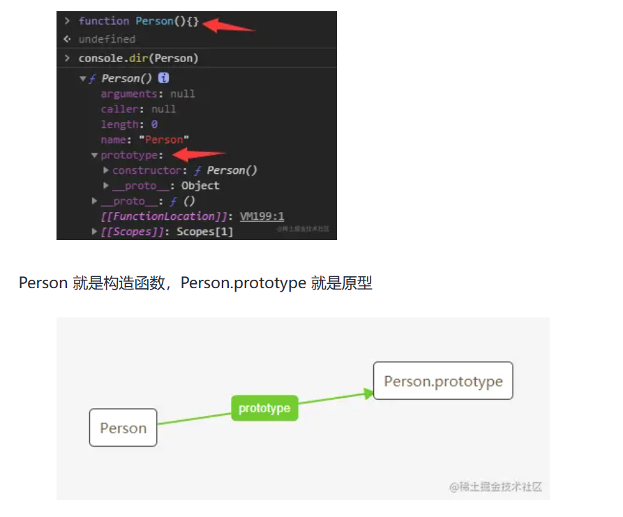
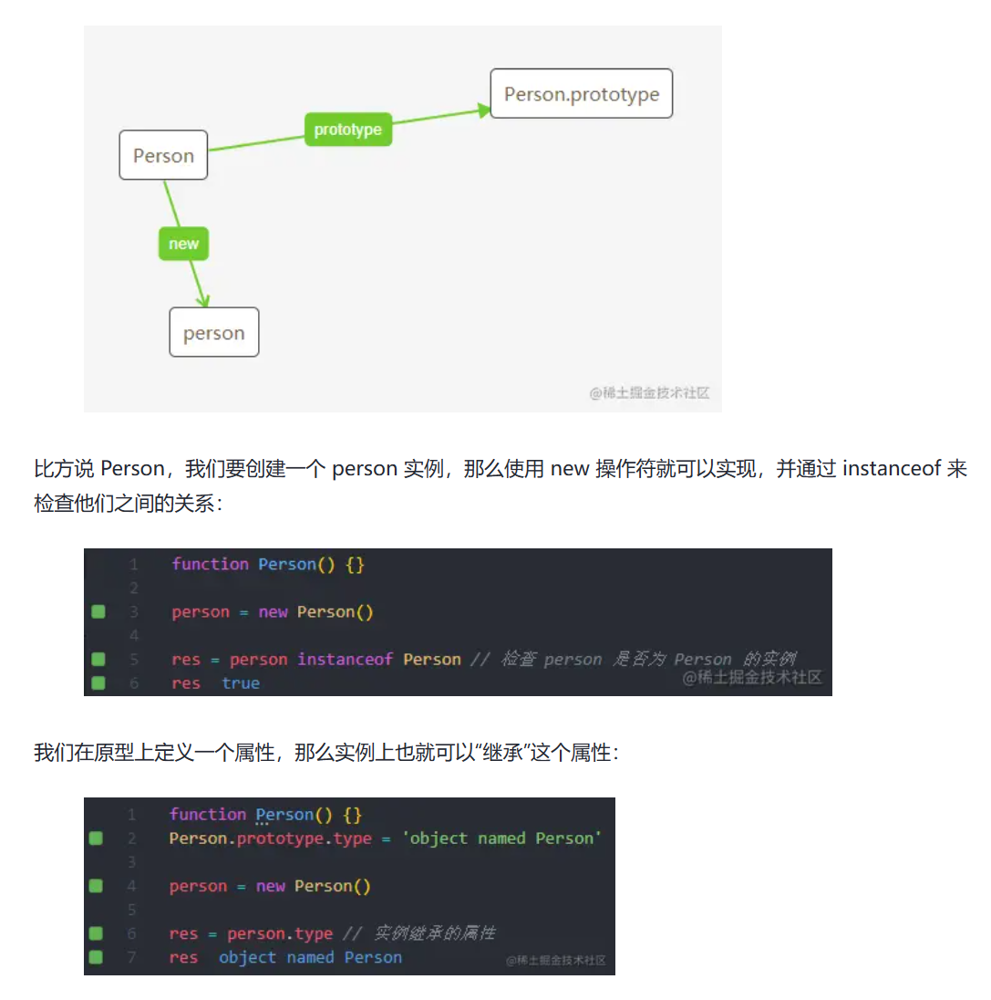
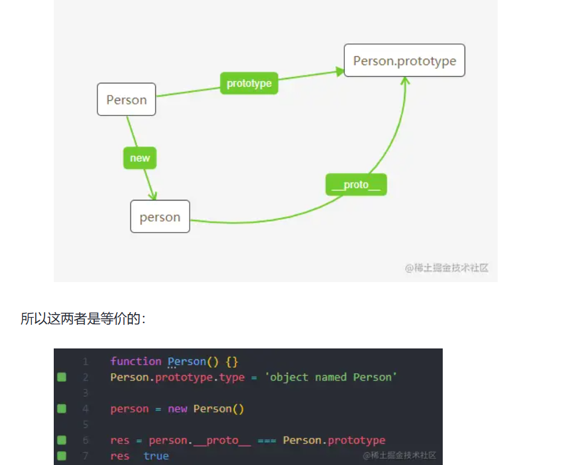
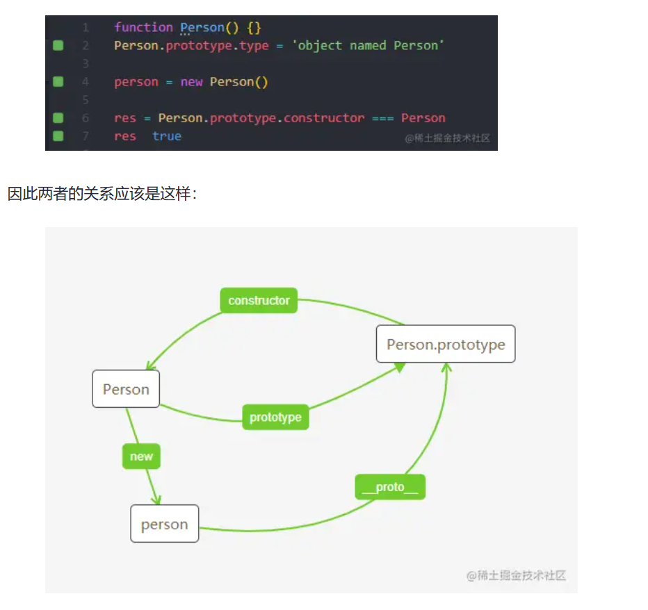
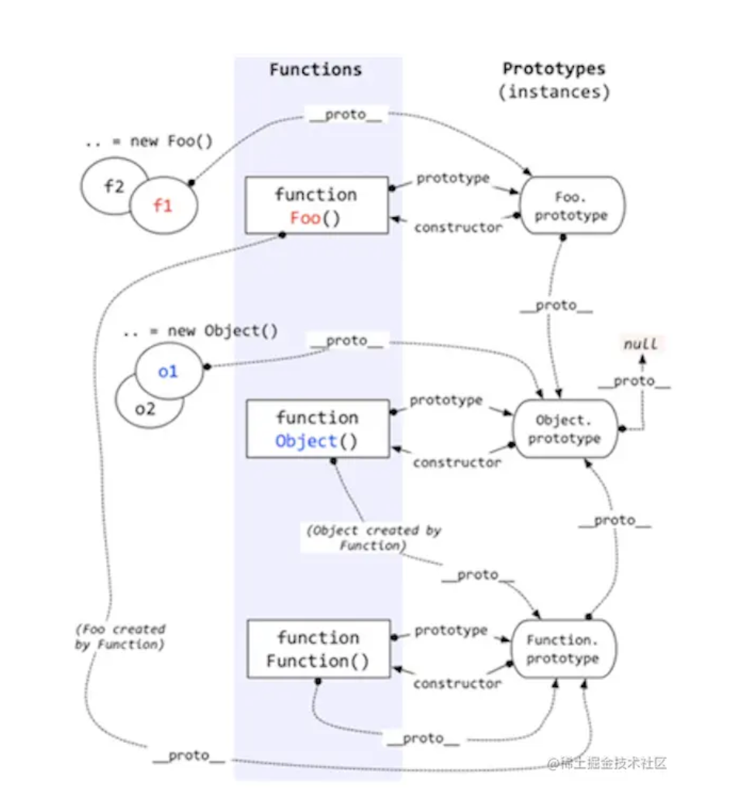

# == 与 === 
- ==
  - 两个等于号==叫做等于操作符，如果**操作数**相等，则会返回true
  - 两个**操作数**都为简单类型，字符串和布尔值都会转换成数值，再比较
  - 简单类型与引用类型比较，对象**转化成**其原始类型的值，再比较
  - 两个**操作数**都为引用类型，则比较它们**是否指向同一个对象**
  - **null 和 undefined 相等**
  - 存在** NaN **则返回 **false**
- ===
  - 三个等于号===叫做全等操作符，只有两个操作数**在不转换的前提**下相等才返回true
  - 
所以，除了在比较对象属性为null或者undefined的情况下，我们可以使用相等操作符（==），其他情况建议一律使用全等操作符（===）

# 作用域
- 作用域 **指程序中定义变量的区域**，它**决定了**当前**执行代码**对**变量**的**访问权限**。
- JavaScript 的作用域分以下三种：
  - **全局作用域**：脚本模式运行所有代码的默认作用域
  - 模块作用域：模块模式中运行代码的作用域
  - **函数作用域**：由函数创建的作用域
  - 此外，用 let 或 const 声明的变量属于额外的作用域：
    - 块级作用域：用一对花括号（一个代码块）创建出来的作用域
- 当可执行代码内部**访问变量**时，会**先查找本地作用域**，如果找到目标变量即返回，**否则**会去**父级作用域继续查找**...一直找到**全局作用域**。我们把这种作用域的嵌套机制，称为 **作用域链**。

# 闭包
- 能够访问**其他函数内部变量的函数**，被称为 闭包。
简单来说，闭包就是**函数内部定义的函数**，**被返回了**出去并在**外部调用。**
## 应用场景
- 单例模式
  - 单例模式的定义是：保证一个类仅有一个实例，并提供一个访问它的全局访问点。
- 在JavaScript中，没有支持声明私有变量，但我们可以使用闭包来模拟私有方法
- 柯里化函数，柯里化的目的在于避免频繁调用具有相同参数函数的同时，又能够轻松的重用
# 内存泄漏
- 并非指内存在物理上的消失，而是应用程序分配某段内存后，由于设计错误，**导致在释放该段内存之前就失去了对该段内存的控制**从而造成了内存的浪费
- 意外的全局变量可能由 this 创建：
   foo 调用自己，this 指向了全局对象（window）
- 定时器也常会造成内存泄露
  - 如果id为Node的元素从DOM中移除，该定时器仍会存在，同时，**因为回调函数中包含对someResource的引用**，定时器外面的someResource也不会被释放
- 闭包，维持函数内局部变量，使其得不到释放
- 没有清理对DOM元素的引用同样造成内存泄露


# JavaScript垃圾回收机制(CG)
- 垃圾回收机制是引擎来做的,V8 引擎发展至今对该机制的优化为例
- **没有了引用关系，也就是无用的对象**这个时候假如任由它搁置，一个两个还好，多了的话内存也会受不了，所以就需要被清理（回收）
- 程序的运行需要内存，只要程序提出要求，操作系统或者运行时就必须提供内存，那么对于持续运行的服务进程，必须要及时释放内存，否则，内存占用越来越高，轻则影响系统性能，重则就会导致进程崩溃
- **可达性**就是那些**以某种方式可访问或者说可用的值**，它们**被保证存储在内存中**，反之**不可访问则需回收**
- 至于如何回收，其实就是怎样发现这些**不可达的对象（垃圾）**它并给予清理的问题， JavaScript 垃圾回收机制的原理说白了也就是**定期找出那些不再用到的内存（变量）**，然后**释放其内存**
## 算法策略
- 标记清除法
引擎在执行 GC（使用标记清除算法）时，需要从出发点去遍历内存中所有的对象去打标记，而这个出发点有很多，我们称之为一组 根 对象，而所谓的根对象，其实在浏览器环境中包括又不止于 **全局Window对象**、**文档DOM树** 等

整个标记清除算法大致过程就像下面这样：
- 垃圾收集器在运行时会给内存中的所有变量都加上一个标记
- 假设内存中所有对象都是垃圾，**全标记为0**
- 然后从各个根对象**开始遍历**，把**不是垃圾的节点改成1**
- **清理**所有标记为**0**的垃圾，**销毁并回收**它们所占用的**内存空间**
- 最后，把所有内存中**对象标记修改为0**，等待下一轮垃圾回收
- 优点
  - 标记清除算法的优点只有一个，那就是实现比较简单
- 缺点
  - 就是在清除之后，剩余的对象内存位置是不变的，也会导致空闲内存空间是不连续的，出现了 **内存碎片**
  - 那如何找到合适的块呢？我们可以采取下面三种分配策略
    - Fist-fit
    - Best-fit
    - Worst-fit
  - 内存碎片化，空闲内存块是不连续的，容易出现很多空闲内存块，还可能会出现分配所需内存过大的对象时找不到合适的块
  - 分配速度慢，因为即便是使用 First-fit 策略，其操作仍是一个 O(n) 的操作，最坏情况是每次都要遍历到最后，同时因为碎片化，大对象的分配效率会更慢
- 引用计数算法
  - 它把对象是否不再需要 简化定义为 **对象有没有其他对象引用到它，如果没有引用指向该对象（零引用），对象将被垃圾回收机制回收**目前很少使用这种算法了，因为它的问题很多，不过我们还是需要了解一下
  - 缺点
    - 循环引用
    - 使用引用计数则不会被清理，因为它们的引用数量不会变成 0，假如此函数在程序中被多次调用，那么就会造成大量的内存不会被释放
    - 引用计数的缺点想必大家也都很明朗了，**首先它需要一个计数器，而此计数器需要占很大的位置**，因为我们也不知道被引用数量的上限，还有就是无法解决循环引用无法回收的问题，这也是最严重的
- 优点
  - 引用计数在引用值为 0 时，也就是在变成垃圾的那一刻就会被回收，所以它可以**立即回收垃圾**

而**标记清除算法**需要**每隔一段时间进行一次**，那在**应用程序（JS脚本）运行过程中****线程就必须要暂停去执行一段时间的 GC**，另外，标记清除算法**需要遍历堆里的活动以及非活动对象来清除**，而**引用计数**则只需要在**引用时计数**就可以了

## V8对GC的优化
- 分代式垃圾回收
  - 试想一下，我们上面所说的垃圾清理算法在每次垃圾回收时都要**检查内存中所有的对象**，这样的话对于一些**大、老、存活时间长的对象**来说**同新、小、存活时间短的对象**一个频率的检查很不好，因为前者需要时间长并且不需要频繁进行清理，后者恰好相反，怎么优化这点呢？？？分代式就来了
  - 新老生代
    - V8 中将**堆内存**分为**新生代**和**老生代**两区域，采用不同的垃圾回收器也就是不同的策略管理垃圾回收
    - 新生代的对象为存活时间较短的对象，简单来说就是**新产生的对象，通常只支持 1～8M 的容量**，而老生代的对象为存活事件较长或常驻内存的对象，简单来说就是经历过新生代垃圾回收后**还存活下来的对象**，容量通常比较大
    - V8 **整个堆内存**的大小就等于**新生代**加上**老生代**的内存
    - V8 采用了两个垃圾回收器来管控，我们暂且将管理新生代的垃圾回收器叫做**新生代垃圾回收器**，同样的，我们称管理老生代的垃圾回收器叫做**老生代垃圾回收器**好了- 


# 原型和原型链
## Constructor构造函数
``function Person(){}``
## prototype原型
- 原型指的就是一个对象，**实例“继承”那个对象的属性(考虑到单例模式)**在原型上定义的属性，通过“继承”，实例也拥有了这个属性。**“继承”**这个行为是在**new 操作符内部实现的**先不说实例，原型与构造函数的关系就是，构造函数内部有一个名为 prototype 的属性，通过这个属性就能访问到原型：

## instance实例
- 有个构造函数，我们就可以在原型上创建可以“继承”的属性，并通过 new 操作符创建实例

## proto 隐式原型
- 实例通过 __proto__ 访问到原型，所以如果是实例，那么就可以通过这个属性直接访问到原型：

## constructor 构造函数
- 既然构造函数通过 prototype 来访问到原型，那么原型也应该能够通过某种途径访问到构造函数，这就是 constructor：

## 原型链


# 构造函数
- 在 JavaScript 中，用 new 关键字来调用的函数，称为构造函数。构造函数首字母一般大写 
# 构造方法
- constructor 是一种用于创建和初始化class创建的对象的特殊方法。

# instanceof 和 typeof 的实现原理
## typeof 实现原理
- typeof 一般被用于判断一个变量的类型，我们可以利用 typeof 来判断number, string, object, boolean, function, undefined, symbol 这七种类型 typeof 在判断一个 object的数据的时候只能告诉我们这个数据是 object, 而不能细致的具体到是哪一种 object
``typeof null // 'object'``
- typeof的实现原理：**js在底层存储变量的时候**会在变量的机器码的**低位1-3位存储其类型信息**
- Object.prototype.toString.call()，我们可以利用这个方法来对一个变量的类型来进行比较准确的判断
## instanceof 操作符的实现原理
```
let person = function () {}
let nicole = new person()
nicole instanceof person // true
```
- 实现原理
```function new_instance_of(leftVaule, rightVaule) { 
    let rightProto = rightVaule.prototype; // 取右表达式的 prototype 值
    leftVaule = leftVaule.__proto__; // 取左表达式的__proto__值
    while (true) {
    	if (leftVaule === null) {
            return false;	
        }
        if (leftVaule === rightProto) {
            return true;	
        } 
        leftVaule = leftVaule.__proto__ 
    }
}
```



# 回流与重绘
## 概念
- 回流
  - 布局引擎会根据各种样式计算每个盒子在页面上的大小与位置
- 重绘
  - 当计算好盒模型的位置、大小及其他属性后，浏览器根据每个盒子特性进行绘制
## 浏览器解析渲染机制
解析HTML，生成**DOM树**，解析CSS，生成**CSSOM树**

将DOM树和CSSOM树结合，生成**渲染树(Render Tree)**

Layout(回流):根据生成的渲染树，进行回流(Layout)，**得到节点的几何信息（位置，大小）**

Painting(重绘):根据渲染树以及回流得到的**几何信息，得到节点的绝对像素**

Display:将像素发送给**GPU，展示在页面上**

## 浏览器优化机制
由于每次重排都会造成额外的计算消耗，**因此大多数浏览器都会通过队列化修改并批量执行来优化重排过程。浏览器会将修改操作放入到队列里，直到过了一段时间或者操作达到了一个阈值，才清空队列**

当你**获取布局信息的操作的时候**，会**强制**队列刷新，包括前面讲到的offsetTop等方法都会返回最新的数据

因此浏览器不得不清空队列，触发回流重绘来返回正确的值

## 如何减少

避免回流的经验：

- 如果想设定元素的样式，通过改变元素的 class 类名 (尽可能在 DOM 树的最里层)
- 避免设置多项内联样式
- 应用元素的动画，使用 position 属性的 fixed 值或 absolute 值(如前文示例所提)
- 避免使用 table 布局，table 中每个元素的大小以及内容的改动，都会导致整个 table 的重新计算
- 对于那些复杂的动画，对其设置 position: fixed/absolute，尽可能地使元素脱离文档流，从而减少对其他元素的影响
- 使用css3硬件加速，可以让transform、opacity、filters这些动画不会引起回流重绘
- 避免使用 CSS 的 JavaScript 表达式

# 大文件上传

## 整体思路

### 前端

前端大文件上传网上的大部分文章已经给出了解决方案，核心是`利用 Blob.prototype.slice` 方法，
和数组的 slice 方法相似，文件的 slice 方法可以返回`原文件的某个切片`

预先定义好单个切片大小，将文件切分为一个个切片，
- 使用` while 循环和 slice 方法将切片放入数组`中,在生成文件切片时，需要给每个切片一个`标识作为 hash`

然后借助 http 的可并发性，同时上传多个切片。
这样从原本传一个大文件，变成了`并发`传多个小的文件切片，可以大大减少上传时间
另外由于是并发，传输到服务端的顺序可能会发生变化，因此我们还需要给每个切片记录顺序
- 调用函数`上传`所有的文件切片，将`文件切片，切片 hash，以及文件名`，再`调用上一步的 request 函数返回一个 proimise，最后调用 Promise.all 并发上传所有的切片`


### 服务端

服务端负责接受前端传输的切片，并在接收到所有切片后`合并`所有切片

这里又引伸出两个问题

1.  何时合并切片，即切片什么时候传输完成
1.  如何合并切片

第一个问题需要前端配合，前端在每个切片中都携带切片最大数量的信息，
当服务端接受到这个数量的切片时自动合并。或者也可以额外发一个请求，主动通知服务端进行切片的合并

第二个问题，具体如何合并切片呢？
这里可以使用 Nodejs 的 读写流（readStream/writeStream），将所有切片的流传输到最终文件的流里


  # 断点续传

断点续传的原理在于前端/服务端需要`记住`已上传的切片，这样下次上传就可以跳过之前已上传的部分，有两种方案实现记忆的功能

-   前端使用 localStorage 记录已上传的切片 hash
-   服务端保存已上传的切片 hash，前端每次上传前向服务端获取已上传的切片

第一种是前端的解决方案
第二种是服务端，而前端方案有一个缺陷，如果换了个浏览器就失去了记忆的效果，所以这里选后者

  

